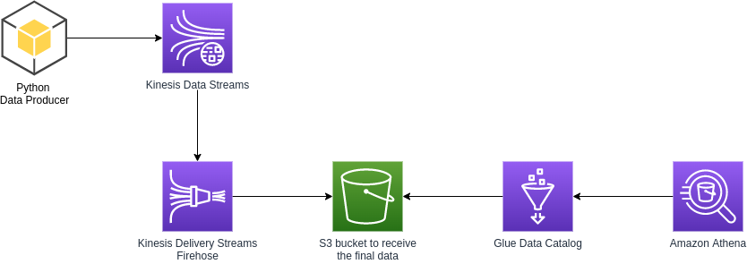
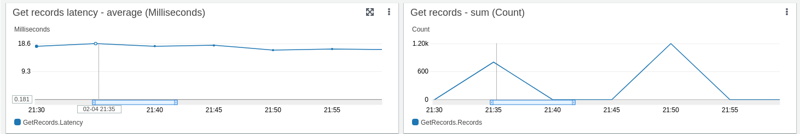
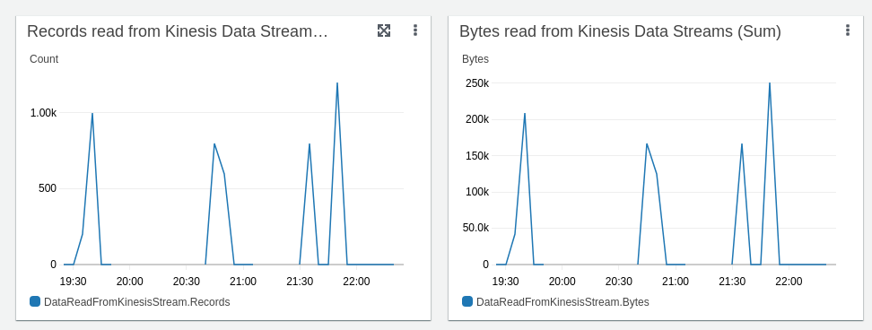
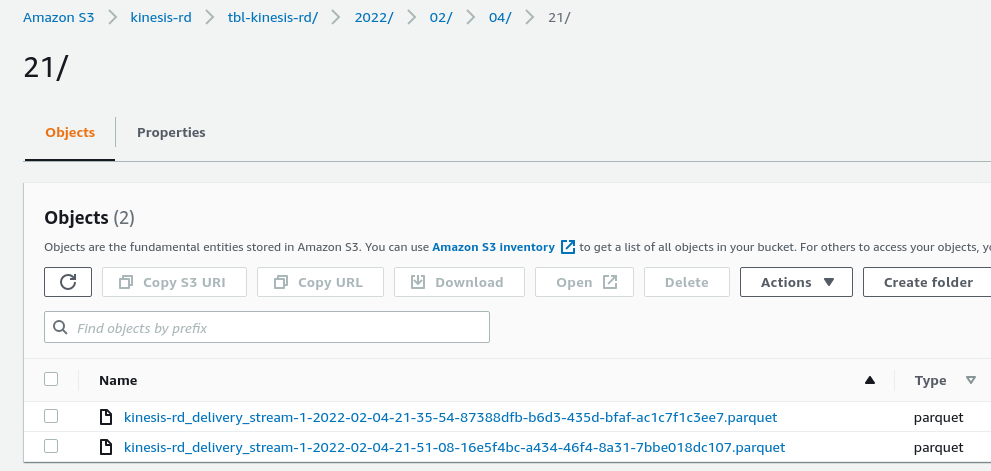
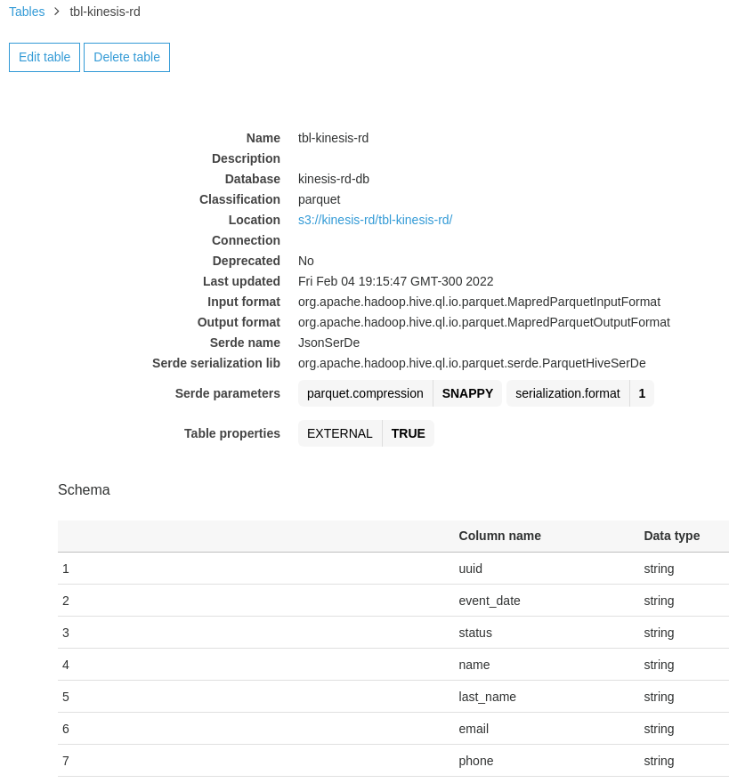
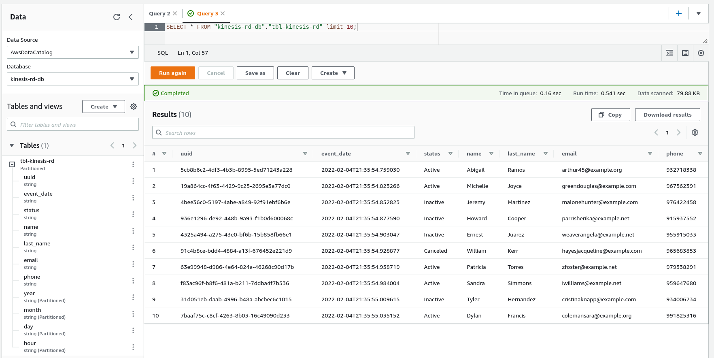

# Kinessis 

## Introduction
Many applications nowadays amass significant amounts of data to build insight and knowledge to add value. A critical factor in the “Big Data” era’s advent is the vast reduction in the data storage cost and the increase of available computing power over the cloud. 

Since the first release of Apache Hadoop in 2008, many Big Data projects have been added to the Data Architect’s toolbox to create more powerful and intelligent solutions.
One of these newer Data Architectures is the so-called Data Lakehouse.


## Problem to solve
We want to illustrate how easy is to start feeding a Data Lake built on top of Amazon S3, based on streaming data. An application may generate events that we might want to store to build insights, knowledge and start creating value from the derived data.


## Journey

Among the several ways to send message streams to Kinesis, we will use a producer developed in Python with the library `Boto3` to establish communication and message delivery. The message producer will use the library `Faker`, widely used for creating random fake data, and a parameter to define the number of messages created and sent to Kinesis.

We will use `Terraform` to automate the creation of necessary resources and ensure version control.
Below we'll list each used resource and their role in that context.
- Data Producer - Python program to generate data;
- Kinesis Data Streams - Will receive the generated messages;
- Kinesis Data Firehose - To deliver the received message, converted into parquet file;
- Amazon S3 - The bucket used to store the generated data;
- Glue Data Catalog - We'll use the Glue Data Catalog to have a unified metastore;
- Amazon Athena - Used to query the data stored at S3 bucket.

The diagram below illustrates the proposed solution's architecture design.

### Architecture



### Environment creation

#### AWS Service deployment
We will validate the infrastructure code developed with Terraform to start the deployment.

If you don't have Terraform installed, here we'll see two approaches, installing from the repository and downloading the standalone version.

```sh
# Installing from repository
$ curl -fsSL https://apt.releases.hashicorp.com/gpg | sudo apt-key add -
$ sudo apt-add-repository "deb [arch=amd64] https://apt.releases.hashicorp.com $(lsb_release -cs) main"
$ sudo apt-get update && sudo apt-get install terraform
$ terraform -version
Terraform v1.1.4
on linux_amd64


# Standalone version
$ curl -o terraform.zip https://releases.hashicorp.com/terraform/1.1.4/terraform_1.1.4_linux_amd64.zip && unzip terraform.zip
$ ./terraform -version
Terraform v1.1.4
on linux_amd64
```

Now we'll need to initialize Terraform by running `terraform init`. Terraform will generate a directory named `.terraform` and download each module source declared in the main.tf file.

Following the best practices, always run the command `terraform plan -out=kinesis-stack-plan` to review the output before creating or changing existing resources.

After getting the plan validated, it's possible to safely apply the changes by running `terraform apply "kinesis-stack-plan"`. Terraform will do one last validation step and prompt user confirmation before applying.

In the video below you will see the whole process to create the environment.

[](https://asciinema.org/a/467199)

#### Data Producer
The code snippet shows how the data dictionary will be created randomly and converted into JSON.

We'll need to convert the dictionary into JSON as this is necessary to put the data in the Kinesis Data Stream.

```python
# Function to produce data
def data_producer():
    fake_data = Faker()
    time_now = datetime.datetime.now()
    time_now_string = time_now.isoformat()
    record_data = {
            'uuid': str(uuid.uuid4()),
            'event_date': time_now_string,
            'status': fake_data.random_element(elements=("Active", "Inactive", "Canceled")),
            'name': fake_data.first_name(),
            'last_name': fake_data.last_name(),
            'email': fake_data.email(),
            'phone': random.randint(900000000, 999999999)
    }
    return record_data

def data_sender(max_record):
        record_count = 0
        # Create the streaming data and send it to our Kinesis Data Stream
        while record_count < max_record:
                data = json.dumps(data_producer())
                print(data)
                kinesis.put_record(
                        StreamName="r-d-kinesis-stream",
                        Data=data,
                        PartitionKey="partitionkey")
                record_count += 1

```

Now is the time to start generating data.

Setup python virtual environment and install dependencies. Making environment isolation is helpful for not breaking any other python library that could be in use.

```sh
# Library setup
$ python3 -m venv env
$ source env/bin/activate
$(env) pip3 install -r requirements.txt
```

We'll start sending ten records to our Kinesis service using the data producer script.


```sh
# Data generation
$(env) python3 data-producer.py --amount 10
2022-02-02T15:17:07 - INFO - Started data generation.
{"uuid": "c4885146-33f7-481d-8cc6-e894b6f33d7f", "event_date": "2022-02-02T15:17:07.618098", "status": "Inactive", "name": "Alicia", "last_name": "Olson", "email": "rwright@example.net", "phone": 910322509}
{"uuid": "df8dd9d8-ce33-4c93-9db2-93df224f8775", "event_date": "2022-02-02T15:17:07.626915", "status": "Active", "name": "Jose", "last_name": "Saunders", "email": "wileytimothy@example.com", "phone": 943771860}
{"uuid": "3c6ccb3c-50b2-43e7-8b77-5435e8a1c063", "event_date": "2022-02-02T15:17:07.637195", "status": "Canceled", "name": "David", "last_name": "Vega", "email": "pjones@example.com", "phone": 909231551}
{"uuid": "2e09d7d0-1c85-4d5d-bc9b-57287fc6563e", "event_date": "2022-02-02T15:17:07.644889", "status": "Active", "name": "Kathleen", "last_name": "Davis", "email": "xnash@example.com", "phone": 927204248}
{"uuid": "276d9ff1-643f-4c0d-a155-1a4f8dbc6f35", "event_date": "2022-02-02T15:17:07.652761", "status": "Inactive", "name": "Samuel", "last_name": "Jones", "email": "millercory@example.com", "phone": 965026462}
{"uuid": "c39535d9-5c29-4438-a7dc-a184fccea498", "event_date": "2022-02-02T15:17:07.660919", "status": "Canceled", "name": "Donna", "last_name": "Myers", "email": "kanejudy@example.org", "phone": 948655060}
{"uuid": "1eff13d4-a0d7-4a62-b1ee-0754dadab4c1", "event_date": "2022-02-02T15:17:07.670282", "status": "Canceled", "name": "Luke", "last_name": "Kelley", "email": "hayesyvonne@example.com", "phone": 992485746}
{"uuid": "d189692d-3d96-4723-b683-2e82ac8a0bcc", "event_date": "2022-02-02T15:17:07.678218", "status": "Inactive", "name": "Tina", "last_name": "Richards", "email": "smithjon@example.net", "phone": 960778676}
{"uuid": "80da5d2e-593f-4ac1-a91e-0f45618085ac", "event_date": "2022-02-02T15:17:07.686308", "status": "Canceled", "name": "John", "last_name": "Fox", "email": "michael33@example.com", "phone": 907743911}
{"uuid": "764cfbeb-7404-4388-9292-abc8eaf634cc", "event_date": "2022-02-02T15:17:07.694925", "status": "Active", "name": "Jeffrey", "last_name": "Willis", "email": "rick01@example.org", "phone": 975060130}
2022-02-02T15:17:07 - INFO - 10 messages delivered to Kinesis.
```
An important point to be aware of is that you will need to wait some seconds to see that generated data arriving into the Kinesis.

Looking at the Kinesis Data Streams statistics graph below, it is possible to follow the rate of received data and processing it.




The same is possible with Kinesis Data Firehose statistics in the graph below.




Navigating inside our S3 bucket, we can see how the Kinesis Data Firehose delivers and organizes the Parquet files, creating "sub-folders" that we will use as partitions (year/month/day/hour - 2022/02/04/21) of our table.




With the unified Data Catalog provided by the AWS Glue service, we can see the schema automatically identified from the messages processed by Kinesis Data Firehose.





Now that our data is available and with its schema defined, we will execute some SQL AdHoc queries using Amazon Athena, as shown below.





At last, we need to destroy our infrastructure by running the command `terraform destroy` to avoid extra costs.
Running the destroy command first asks for a confirmation and proceeds to delete the infrastructure on receiving a yes answer, as you can see in this short video.


[](https://asciinema.org/a/467200)


## Conclusion

The new paradigm of the Data Lakehouse architecture is arriving to deliver more opportunities to the businesses that are planning to start their Data-Driven Journey, where now the range of technology, frameworks, and cost related to Cloud Platform is more attractive than ever.
In this first post, we walk through one scenario of technology usage for receiving stream data with Kinesis Data Streams, process it in real-time using Kinesis Data Firehose, and deliver the data to object storage, where it will be available for further usage by Data Analysts, ML Engineers, running SQL AdHoc query using Amazon Athena.
